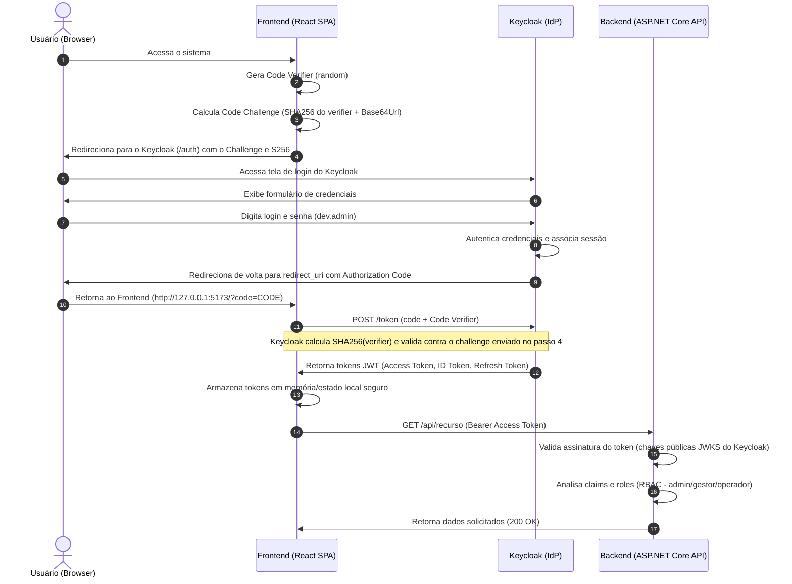

# Autenticação e Autorização com Keycloak

Este documento descreve a arquitetura e o fluxo de controle de identidade, autenticação e autorização (IAM) do ecossistema WebApólice, baseado no padrão OpenID Connect (OIDC) e usando o **Keycloak** como o Provedor de Identidade (IdP) centralizado.

---

## 1. Visão Geral do Modelo de Segurança

A arquitetura de segurança do WebApólice baseia-se nos seguintes pilares fundamentais:
* **Single Sign-On (SSO)**: A autenticação é delegada de forma centralizada ao Keycloak. Usuários realizam login no IdP e obtêm sessões unificadas válidas para todas as aplicações autorizadas.
* **Provedor de Identidade Central**: O Keycloak gerencia cadastros, políticas de senhas, sessões de usuários, emissão de tokens e federação de identidades (se aplicável no futuro).
* **OpenID Connect (OIDC) e OAuth 2.0**: Protocolos abertos padrão de mercado para autenticação e autorização federada baseada em tokens JWT (JSON Web Tokens).
* **Role-Based Access Control (RBAC)**: A autorização para execução de recursos operacionais baseia-se em roles atribuídas globalmente aos usuários (ex: `admin`, `gestor`, `operador`).

---

## 2. Fluxo de Autenticação: Authorization Code com PKCE

Para aplicações do tipo Single Page Application (SPA), como o frontend React do WebApólice, o fluxo recomendado e obrigatório de autenticação é o **Authorization Code Flow com PKCE (Proof Key for Code Exchange)** (especificado na [RFC 7636](https://tools.ietf.org/html/rfc7636)). 

Este fluxo elimina a necessidade de armazenar um segredo de client (*client secret*) no código Javascript do frontend, protegendo a aplicação contra ataques de interceptação do código de autorização.

### Diagrama de Sequência do Fluxo PKCE

O diagrama abaixo descreve a interação entre o usuário, o Frontend React, o Keycloak (IdP) e o Backend ASP.NET Core:

---

## 3. Estrutura dos Tokens JWT

O Keycloak emite três tipos de tokens OIDC codificados como JSON Web Tokens (JWT):

### A. Access Token
Token contendo as autorizações e roles atribuídas ao usuário. É enviado ao backend no cabeçalho `Authorization: Bearer <TOKEN>`.
* **Exemplo de Claims Críticas**:
  * `iss`: Emissor do token (`http://127.0.0.1:8080/realms/webapolice`).
  * `aud`: Audiência-alvo do token. O client `webapolice-web` possui um *Audience Mapper* configurado que insere o valor `webapolice-api` neste claim, garantindo que a API só aceite tokens destinados a ela.
  * `sub`: ID único do usuário no Keycloak.
  * `azp`: Client que solicitou o token (`webapolice-web`).
  * `realm_access.roles`: Lista de roles globais do realm atribuídas ao usuário (ex: `["admin"]`). No backend ASP.NET Core, um `IClaimsTransformation` customizado traduz essas roles para claims padrão `ClaimTypes.Role` a fim de viabilizar o uso do atributo `[Authorize(Roles="...")]` ou políticas de autorização.

### B. ID Token
Token contendo informações cadastrais básicas do usuário (para personalização da interface e exibição de dados de perfil).
* **Claims**: `name`, `preferred_username`, `email`, `given_name`, `family_name`.

### C. Refresh Token
Token de longa duração utilizado pelo frontend para solicitar novos Access Tokens de forma silenciosa ao Keycloak quando os antigos expirarem, sem forçar o usuário a digitar suas credenciais novamente.

---

## 4. Estrutura de Roles e Permissões (RBAC)

O WebApólice define três roles principais a nível de realm (roles globais):

| Role | Perfil de Usuário | Permissões Típicas (Backend) |
|---|---|---|
| `admin` | Administrador de TI / Sistema | Acesso a configurações globais, auditorias de segurança e gerenciamento de usuários. |
| `gestor` | Gerente de Negócios / Operações | Acesso a relatórios financeiros, liberação de propostas sob exceção e análise de dados consolidados. |
| `operador` | Operador de Vendas / Cadastro | Cadastro de segurados, emissão de apólices básicas e consulta de informações cadastrais cotidianas. |

---

## 5. Diretrizes de Segurança para o Desenvolvimento e Produção

Ao implementar a integração de código, observe atentamente as seguintes diretrizes:

### A. Armazenamento de Tokens no Frontend
* **Regra**: Nunca armazene o `access_token` ou `refresh_token` no `localStorage` ou `sessionStorage` em ambiente de produção, pois eles ficam vulneráveis a ataques de Cross-Site Scripting (XSS).
* **Recomendação**: Mantenha os tokens em memória Javascript (estado global React) ou utilize um padrão de proxy BFF (*Backend-For-Frontend*) que armazene os tokens em cookies criptografados com as flags `HttpOnly`, `Secure` e `SameSite=Strict`.

### B. Validação de Tokens no Backend
* **Regra**: O backend ASP.NET Core deve validar localmente a assinatura criptográfica dos tokens JWT usando o endpoint JWKS (JSON Web Key Set) exposto pelo Keycloak (`/realms/webapolice/protocol/openid-connect/certs`).
* **Regra**: O backend deve validar de forma estrita o emissor (`iss`), a audiência (`aud`) e a expiração do token (`exp`).

### C. TLS/SSL Mandatório em Produção
* No ambiente de desenvolvimento local, a comunicação é permitida via HTTP simples na rede `127.0.0.1`.
* Em ambiente de produção e homologação, todos os endpoints do Keycloak, do backend e do frontend **devem rodar exclusivamente sob HTTPS (TLS 1.3)**.
