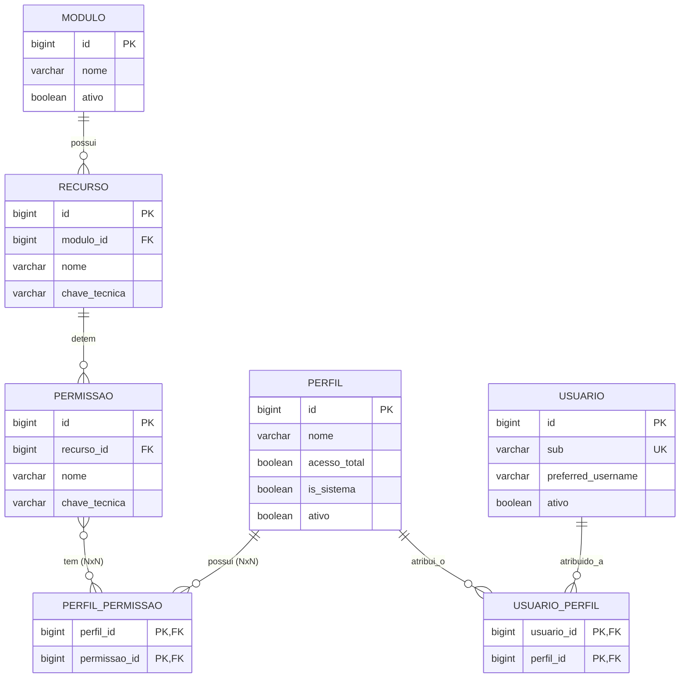

# Modelo Conceitual de Dados

O novo modelo propõe um isolamento funcional por meio do schema `seguranca`. Esse schema centralizará toda a matriz de concessão de acessos.

## 1. Descrição das Tabelas e Proposta Preliminar

A modelagem segue a arquitetura relacional clássica, com tabelas mapeadas utilizando a convenção `snake_case`.

### 1.1 Tabelas Estruturais da Matriz
As três primeiras tabelas servem como catálogo inalterável pelos usuários. Seus dados nascerão juntamente com o código (scripts DDL versionados).

* **`seguranca.modulo`**: A grande área macro do ERP (ex: CADASTRO, FINANCEIRO).
  * `id` (bigserial, PK)
  * `nome` (varchar, Unique)
  * `descricao` (varchar)
  * `ativo` (boolean)
  * *(Auditoria: created_at, updated_at, deleted_at)*
* **`seguranca.recurso`**: O agrupador da funcionalidade. Ex: "Clientes".
  * `id` (bigserial, PK)
  * `modulo_id` (bigint, FK)
  * `nome` (varchar)
  * `descricao` (varchar)
  * `chave_tecnica` (varchar, Unique, ex: `clientes`)
  * *(Auditoria: created_at, updated_at, deleted_at)*
* **`seguranca.permissao`**: A micro-ação em si que será requerida pelos Handlers. Ex: "Inserir"
  * `id` (bigserial, PK)
  * `recurso_id` (bigint, FK)
  * `nome` (varchar)
  * `chave_tecnica` (varchar, Unique, ex: `clientes.inserir`)
  * *(Auditoria: created_at, updated_at, deleted_at)*

### 1.2 Tabelas de Relacionamento (Gestão por Administradores)
Tabelas geridas no front-end por um Gestor ou Administrador (telas de permissões e usuários).

* **`seguranca.perfil`**: O grupo de acesso.
  * `id` (bigserial, PK)
  * `nome` (varchar, Unique)
  * `descricao` (varchar)
  * `acesso_total` (boolean) - *Flag superuser p/ perfil ADMINISTRADOR.*
  * `is_sistema` (boolean) - *Indica que o perfil foi criado via script inicial e não pode ser deletado.*
  * `ativo` (boolean)
  * *(Auditoria: created_at, updated_at, deleted_at)*
* **`seguranca.perfil_permissao`**: (Matriz NxN).
  * `perfil_id` (bigint, FK, PK)
  * `permissao_id` (bigint, FK, PK)

### 1.3 Tabelas de Provisionamento e Concessão Pessoal
* **`seguranca.usuario`**: O elo entre os tokens do Identity Provider e os cadastros ERP.
  * `id` (bigserial, PK)
  * `sub` (varchar, Unique) - *O ID real global do Keycloak.*
  * `preferred_username` (varchar) - *Login legível retornado pelo IdP.*
  * `nome` (varchar)
  * `email` (varchar)
  * `ativo` (boolean) - *Flag para suspensão de acesso no backend interno.*
  * *(Auditoria: created_at, updated_at, deleted_at)*
* **`seguranca.usuario_perfil`**: Concessão das responsabilidades ao usuário (NxN).
  * `usuario_id` (bigint, FK, PK)
  * `perfil_id` (bigint, FK, PK)

### 1.4 Tabelas de Histórico/Auditoria
* **`seguranca.auditoria_permissao`**: Detalhes no documento [Auditoria](05-auditoria-seguranca.md). Armazenará as transições e movimentações de permissões e perfis de usuário.

## 2. Diagrama de Relacionamento (ERD)

## 3. Exemplo Prático de Cadastro Mapeado

### Módulo e Recurso
- **Modulo:** `id = 1`, `nome = 'CADASTRO'`
- **Recurso:** `id = 1`, `modulo_id = 1`, `nome = 'Clientes'`, `chave_tecnica = 'clientes'`

### Permissões Derivadas
- `id = 1, recurso_id = 1, nome = 'Visualizar Clientes', chave_tecnica = 'clientes.visualizar'`
- `id = 2, recurso_id = 1, nome = 'Inserir Cliente', chave_tecnica = 'clientes.inserir'`
- `id = 3, recurso_id = 1, nome = 'Inativar Cliente', chave_tecnica = 'clientes.inativar'`

### Perfis Base
- **Perfil 1 (ADMINISTRADOR):** `is_sistema = true`, `acesso_total = true`. Não precisa de mapeamento 1-a-1 na `perfil_permissao`.
- **Perfil 2 (ADMINISTRATIVO):** `is_sistema = true`, `acesso_total = false`.
  - Mapeamento na `perfil_permissao`: `perfil_id=2` vinculado às Permissões 1, 2 e 3 (Visualizar, Inserir, Inativar).

*Nota: Um usuário comum atrelado a ambos teria todas as regras concedidas unidas, assumindo naturalmente `acesso_total=true` pela presença do perfil Administrador.*
