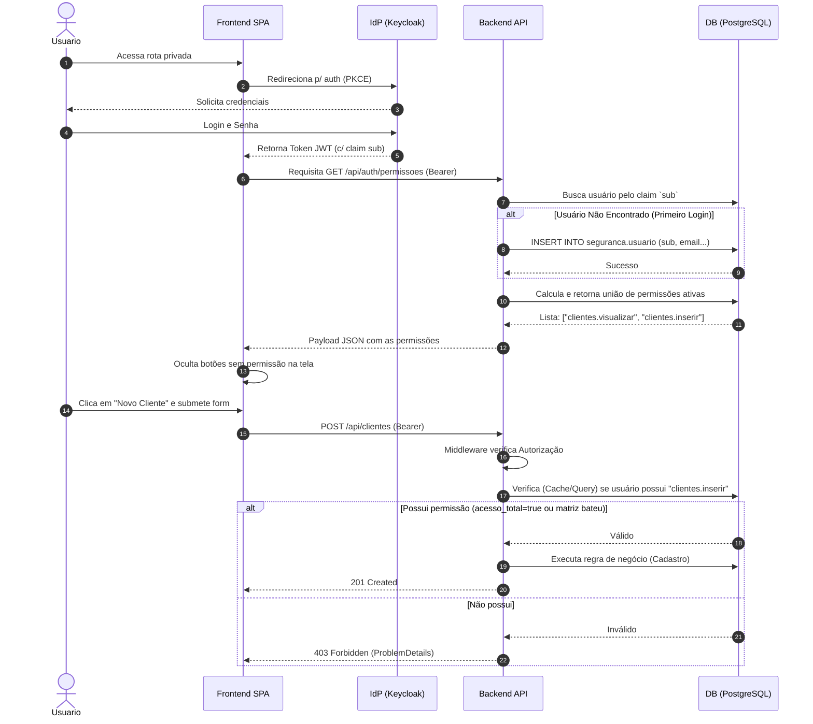

# Fluxo de Autenticação e Autorização

O módulo divide a segurança da aplicação em duas etapas rigorosas: a validação de quem está tentando acessar o sistema (Keycloak via OIDC) e o que essa pessoa pode realizar de fato lá dentro (API Backend via PostgreSQL).

## 1. Fluxo de Login Primário
1. O usuário não autenticado tenta acessar uma rota protegida do Frontend SPA.
2. O Frontend, utilizando a biblioteca Keycloak-js e o fluxo OAuth 2.0 (Authorization Code with PKCE), redireciona o usuário para a tela oficial de login do provedor IdP (Keycloak).
3. O usuário insere credenciais (e MFA, se habilitado). O Keycloak valida e devolve um Access Token e ID Token estruturados (JWT) para o SPA.
4. O Token passa a acompanhar automaticamente cada requisição Backend injetado no header `Authorization: Bearer <TOKEN>`.

## 2. Provisionamento e Leitura de Contexto
Toda requisição segura enviada à API será recebida primeiramente pelo Middleware de Autenticação (`JwtBearer`) do ASP.NET Core, que:
1. Validará a chave criptográfica JWKS pública do Keycloak (certificando autenticidade).
2. Extrairá o identificador único do usuário (claim `sub` nativo do Keycloak). Por convenção, o ASP.NET Core também mapeia esse valor internamente para o `ClaimTypes.NameIdentifier`.

Para viabilizar o uso consistente deste identificador sem acoplar o resto da aplicação a objetos HTTP, o módulo expõe a interface `IContextoUsuarioAutenticado`. Essa abstração extrai, em tempo de requisição, o `sub` do `HttpContext`, garantindo que:
- E-mail e Username não sejam usados como substitutos.
- Não haja acessos não autorizados sem a presença robusta dessa claim.

Logo em seguida, a requisição passa pelo `ProvisionamentoUsuarioMiddleware`, que consome o contexto. O middleware faz um *look-up* em `seguranca.usuario` buscando por aquele `sub`:
* **Se não existir**, um novo registro é provisionado no mesmo instante (JIT - *Just-In-Time*). Ele será criado atrelado puramente ao `sub`, extraindo do token os claims cadastrais opcionais `preferred_username`, `name` e `email` para preencher os dados auxiliares (`Username`, `Nome` e `Email`). Nenhuma role é associada e o usuário não recebe perfil automático. O registro nascerá com `ativo = true`.
* **Se existir**, o sistema atualiza seus dados cadastrais caso o Keycloak reporte valores diferentes daqueles armazenados, mantendo-os sincronizados. Usuários com `ativo = false` permanecem inativos e o identificador `sub` nunca é alterado. Valores de claims ausentes no token atual não sobrescrevem com *null* os dados preexistentes. A proteção contra concorrência e criação duplicada é garantida pela constraint UNIQUE no schema do PostgreSQL.

## 3. Autorização Granular Backend
Sempre que um endpoint solicitar uma regra funcional (ex: `[AuthorizePermissao(PermissoesSeguranca.Clientes.Inativar)]`):
1. O policy provider dinâmico `PermissaoPolicyProvider` interceptará a construção da policy "Permissao:clientes.inativar" inserindo um `PermissaoRequirement` nela.
2. O `PermissaoAuthorizationHandler` entrará em ação, validando se a requisição está autenticada. Se sim, identificará o `sub` do usuário.
3. Através do `IPermissoesEfetivasService` (injetado via escopo da requisição HTTP), a lista linear (1D) de Permissões atreladas a esse usuário é obtida. A busca pode ser feita pelo banco de dados ou a um *Cache Distribuído*. Durante essa chamada o `CancellationToken` da requisição repassado evita processamento desnecessário se a conexão for abortada.
4. **Regra de União**: As permissões efetivas do usuário são extraídas através de uma consulta otimizada (via `UsuarioRepository`) que filtra apenas as relações ativas em toda a cadeia:
   - Apenas perfis ativados
   - Apenas permissões ativadas
   - Apenas recursos ativados
   - Apenas módulos ativados
   A query retorna um HashSet único com os códigos das permissões validadas. Em SQL equivalente, a instrução assegura:
   ```sql
   SELECT DISTINCT p.codigo
   FROM seguranca.usuario_perfil up
   INNER JOIN seguranca.perfil perf ON perf.id = up.perfil_id
   INNER JOIN seguranca.perfil_permissao pp ON pp.perfil_id = perf.id
   INNER JOIN seguranca.permissao p ON p.id = pp.permissao_id
   INNER JOIN seguranca.recurso r ON r.id = p.recurso_id
   INNER JOIN seguranca.modulo m ON m.id = r.modulo_id
   WHERE up.usuario_id = @UsuarioId
     AND perf.ativo = true
     AND p.ativo = true
     AND r.ativo = true
     AND m.ativo = true;
   ```
4. Se o usuário constar atrelado em algum perfil onde `acesso_total = true`, esse carregamento é mitigado e o acesso é *Granted* universalmente.
5. Em caso da chave solicitada estar presente na lista efetiva, o pipeline avança.
6. Em caso negativo, devolve Status **403 Forbidden**. Se o Token em si foi inválido, rejeita muito antes como **401 Unauthorized**.

## 4. Consumo Pelo Frontend
O frontend invocará um novo endpoint como `GET /api/auth/permissoes` para carregar o seu pacote de diretrizes. Em posse das chaves (e.g. `['clientes.visualizar', 'financeiro.editar']`), os elementos visuais na UI se habilitarão utilizando novos Hooks base (ex: `useAuth().hasPermission()`).
*O front-end **nunca** infere funções deduzindo nomes de perfis.*

## 5. Diagrama de Sequência Híbrido


